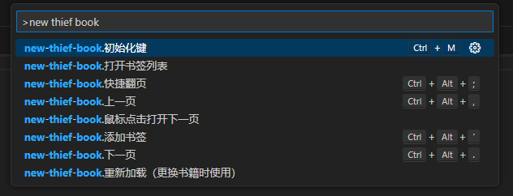
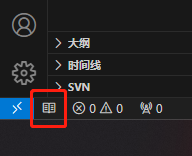

# new-thief-book README

在`better-thief-book`扩展的基础上，实现了单击翻页，双击隐藏

# 使用姿势
`cmd + shift + p` 输入 `new-thief-book`，可以看到所有命令

`cmd + m` 激活扩展，点击📖图标显示小说栏，双击小说栏隐藏，双击📖图标实现强力隐藏(再次输入`cmd + m`重新显示📖图标)

# 快捷键
### Windows
`ctrl + alt + ,`  上一页  
`ctrl + alt + .`  下一页  
`ctrl + alt + ;`  快捷翻页  
`ctrl + alt + '`  添加书签
### Mac OS
`cmd + ,` 上一页  
`cmd + .` 下一页  
`cmd + ;` 快捷翻页  
`cmd + '` 添加书签
